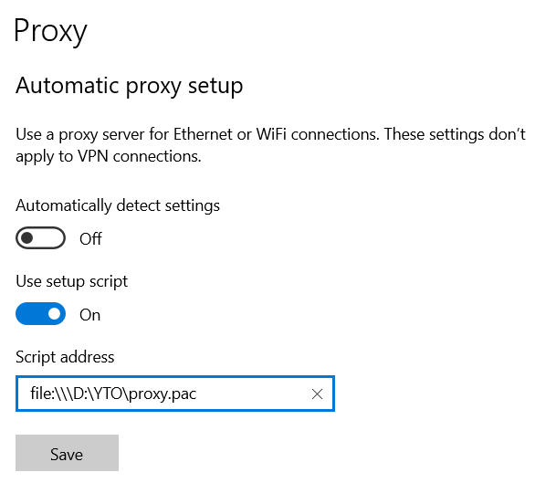

# YTO (YT Optimizer), for Windows 10 x64 only

**1.** Install Visual C++ 2015-2022 (VC_2015-2022_x64.exe)

**2.** Change system proxy settings:

• Use setup script (On)

• Script address -> Enter path to the proxy.pac

•                -> Save

**3.** Currently working on how to do the same thing on an android phone...